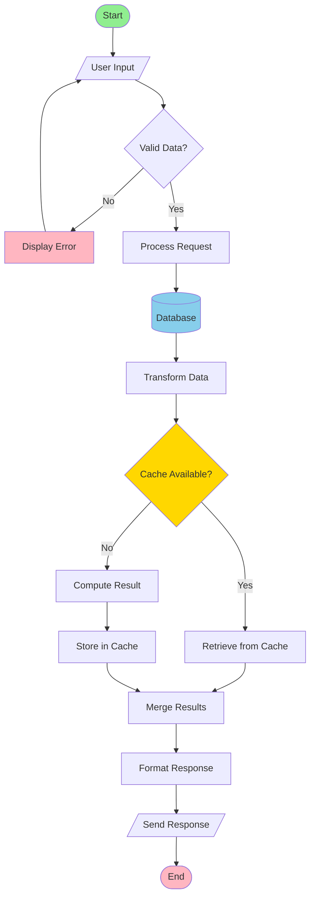

# page2

GitBook content part 2

Making a change :thumbsup:

Change this page againß

Let me change this one too just in case, separate files, separate folders, completely separate places.

```mermaid
graph TD
    subgraph "💻 Backend Development"
        A[🔧 NestJS Monorepo]
        B[📦 NX + TypeScript]
        C[🧪 Jest Testing]
    end
    
    subgraph "🎨 Frontend Development"
        D[⚛️ React MFE Monorepo]
        E[📦 NX + Vite]
        F[🎨 MUI Components]
    end
    
    subgraph "🐍 AI/ML Platform"
        G[🤖 Python GenAI Services]
        H[🔧 Flask/FastAPI]
        I[☸️ Kubernetes + KEDA]
    end
    
    subgraph "🧠 AI/ML Microservices"
        J[🔍 Individual Python Services]
        K[📦 Poetry + FastAPI]
        L[🚀 Advanced Deployment]
    end
    
    subgraph "🏗️ Infrastructure & Data"
        M[🏗️ Terraform Enterprise]
        N[📊 Azure Synapse]
        O[🔒 Approval Gates]
    end
    
    subgraph "📱 Legacy Applications"
        P[📱 MFE Microrepos]
        Q[🔧 Individual Repos]
        R[🐳 Docker Builds]
    end
    
    A --> S[🔄 Automated CI]
    D --> S
    G --> T[🎛️ Manual Deploy]
    J --> U[🚀 Advanced Deploy]
    M --> V[🔒 Approved Deploy]
    P --> S
    
    S --> W[🟦 Azure DevOps CD]
    T --> X[☸️ Kubernetes Deploy]
    U --> Y[🔄 Self-Triggering]
    V --> Z[🏗️ Infrastructure Deploy]
    
    style A fill:#e74c3c,color:#fff
    style D fill:#3498db,color:#fff
    style G fill:#9b59b6,color:#fff
    style J fill:#8e44ad,color:#fff
    style M fill:#2c3e50,color:#fff
    style P fill:#f39c12,color:#fff
```

```mermaid
flowchart TD
    Start([Start]) --> Input[/User Input/]
    Input --> Validate{Valid Data?}
    
    Validate -->|No| Error[Display Error]
    Error --> Input
    
    Validate -->|Yes| Process[Process Request]
    Process --> DB[(Database)]
    
    DB --> Transform[Transform Data]
    Transform --> Cache{Cache Available?}
    
    Cache -->|Yes| Retrieve[Retrieve from Cache]
    Cache -->|No| Compute[Compute Result]
    
    Retrieve --> Merge[Merge Results]
    Compute --> Store[Store in Cache]
    Store --> Merge
    
    Merge --> Format[Format Response]
    Format --> Output[/Send Response/]
    Output --> End([End])
    
    style Start fill:#90EE90
    style End fill:#FFB6C1
    style Error fill:#FFB6C1
    style DB fill:#87CEEB
    style Cache fill:#FFD700
```
